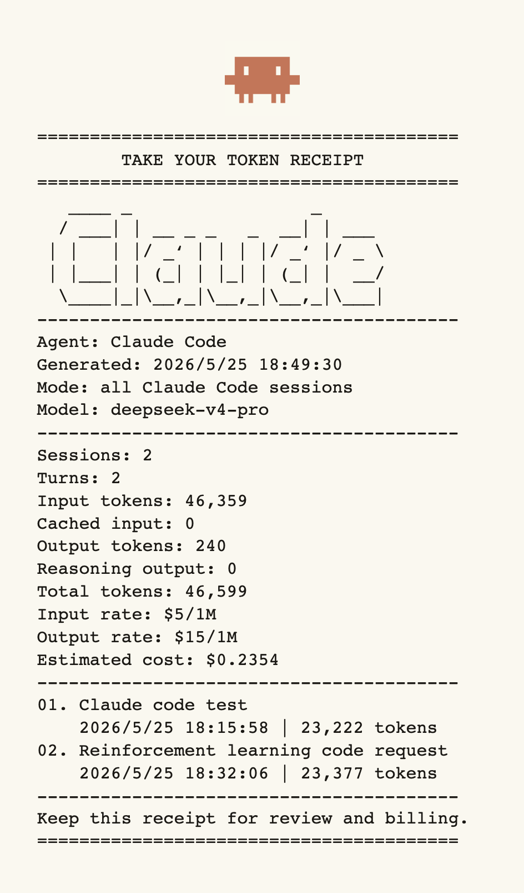
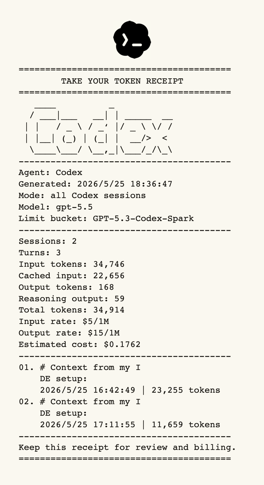

# Take Your Token Receipt
<div align="center">
    
    
</div>

`Take Your Token Receipt` is a tiny CLI that prints receipt-style token usage summaries from local Codex and Claude Code sessions.

## Quick Start

Run the latest-session receipt:

```bash
npm run receipt
```

Or call the CLI file directly:

```bash
node bin/tytr.mjs
```

After linking the package locally, use the shorter command:

```bash
npm link
tytr
```
To generate a receipt with all things, use:
```bash
tytr claude --all --input-rate 5 --output-rate 15 --pdf claude-receipt-priced.pdf # For claude code
tytr --all --input-rate 5 --output-rate 15 --pdf codex-receipt-priced.pdf # For codex
```
change the `rate` by your self.
## Commands

Latest Codex session:

```bash
tytr
```

All local Codex sessions:

```bash
tytr --all
```

Latest Claude Code session:

```bash
tytr claude
```

All local Claude Code sessions:

```bash
tytr claude --all
```

Save a text receipt:

```bash
tytr --save receipt.txt
```

Save an 80mm receipt-style PDF:

```bash
tytr --pdf receipt.pdf
tytr claude --pdf claude-receipt.pdf
```

Save all local conversations to PDF:

```bash
tytr --all --pdf receipt-all.pdf
tytr claude --all --pdf claude-receipt-all.pdf
```

Estimate cost with per-1M-token prices:

```bash
tytr --input-rate 5 --output-rate 15
tytr claude --input-rate 5 --output-rate 15
tytr --input-rate 5 --output-rate 15 --pdf receipt-priced.pdf
tytr claude --input-rate 5 --output-rate 15 --pdf claude-receipt-priced.pdf
```

Output JSON for another script or printer pipeline:

```bash
tytr --json
```

Print with the system printer:

```bash
tytr --pdf receipt.pdf
lp receipt.pdf
```

## NPM Scripts

The package wraps the common commands:

```bash
npm start
npm run receipt
npm run receipt:all
npm run receipt:all:pdf
npm run receipt:claude
npm run receipt:claude:all
npm run receipt:claude:all:pdf
npm run receipt:claude:pdf
npm run receipt:claude:priced
npm run receipt:claude:priced:pdf
npm run receipt:json
npm run receipt:priced
npm run receipt:priced:pdf
npm run receipt:save
npm run receipt:pdf
npm run check
```

## Options

- `codex`: read Codex logs, which is the default
- `claude`: read Claude Code logs
- `--provider <codex|claude>`: choose the log reader without using the positional name
- `--latest`: print the latest selected agent session receipt, which is the default
- `--all`: aggregate every local selected agent session
- `--sessions-dir <path>`: read JSONL sessions from a custom directory
- `--agent <name>`: change the agent name printed on the receipt
- `--input-rate <usd>`: input price per 1M tokens, used only for cost estimation
- `--output-rate <usd>`: output price per 1M tokens, used only for cost estimation
- `--title-width <chars>`: session title width before wrapping/truncation, default `19`
- `--save <path>`: save the text receipt to a file
- `--pdf <path>`: save an 80mm receipt-style PDF
- `--json`: print structured JSON instead of the receipt
- `-h, --help`: show CLI help

## What The Receipt Shows
```Plain text
========================================
        TAKE YOUR TOKEN RECEIPT
========================================
   ____          _           
  / ___|___   __| | _____  __
 | |   / _ \ / _` |/ _ \ \/ /
 | |__| (_) | (_| |  __/>  < 
  \____\___/ \__,_|\___/_/\_\
----------------------------------------
Agent: Codex
Generated: 2026/5/25 16:43:05
Mode: latest Codex session
Model: gpt-5.5
Limit bucket: GPT-5.3-Codex-Spark
----------------------------------------
Sessions: 1
Turns: 2
Input tokens: 23,185
Cached input: 18,176
Output tokens: 70
Reasoning output: 0
Total tokens: 23,255
Input rate: $5/1M
Output rate: $15/1M
Estimated cost: $0.1170
----------------------------------------
01. # Context from my I
    DE setup:
    2026/5/25 16:42:49 | 23,255 tokens
----------------------------------------
Keep this receipt for review and billing.
========================================
```

- Agent name and ASCII logo
- PNG icon in generated PDF receipts, selected from `icons/codex.png` or `icons/claudecode-color.png`
- Generated time
- Latest or all-session mode
- Actual model when it is present in the session log
- Codex rate-limit bucket when it is present in the token log
- Session count and turn count
- Input, cached input, output, reasoning output, and total tokens
- Optional input/output rates and estimated cost
- Session titles. Latest mode shows the latest session; all mode lists every selected session.

## PDF Receipts

`--pdf` writes a narrow, receipt-shaped PDF while keeping the ASCII terminal output. The PDF header embeds the selected PNG icon, then prints the ASCII receipt below it. If `--input-rate` and `--output-rate` are present, the rates and estimated cost are printed into the PDF too. ASCII-only lines use Courier so the logo keeps its shape. Lines with CJK characters use a built-in PDF CJK font mapping so local session titles can still appear in the generated PDF.

## Notes

- The default Codex session directory is `~/.codex/sessions`.
- The default Claude Code session directory is `~/.claude/projects`.
- You can override Codex with `--sessions-dir <path>` or `CODEX_SESSIONS_DIR`.
- You can override Claude Code with `--sessions-dir <path>`, `CLAUDE_CODE_SESSIONS_DIR`, or `CLAUDE_CODE_PROJECTS_DIR`.
- `Limit bucket` comes from Codex rate-limit metadata. It is not the same thing as the actual model.
- Cost estimation is optional and only uses the rates you pass in.
